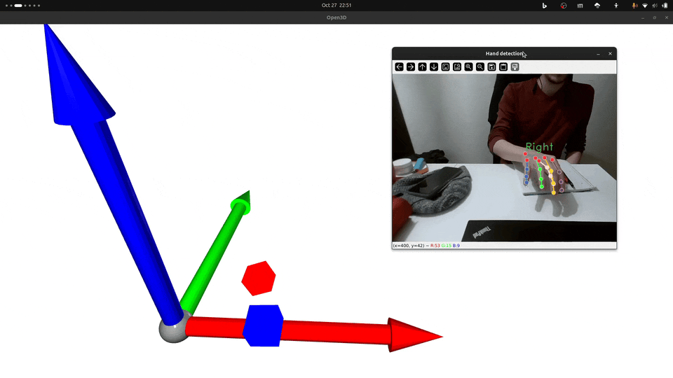

# LacnýTeleop
Simple teleoperation via webcam using hand pose recognition from MediaPipe and monocular depth estimation from DepthAnythingV2

## Install
- `pip install -r requirements.txt`

## Try it out
- `python -m lacny_teleop.demo.pose_estimator_accuracy` for an open3d visualization (from screenshot).
- `python -m lacny_teleop.demo.pose_estimator_vis` for a matplotlib visualization.
